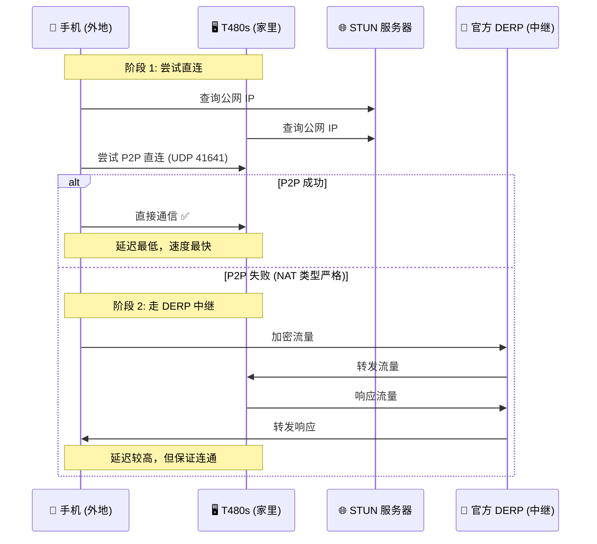
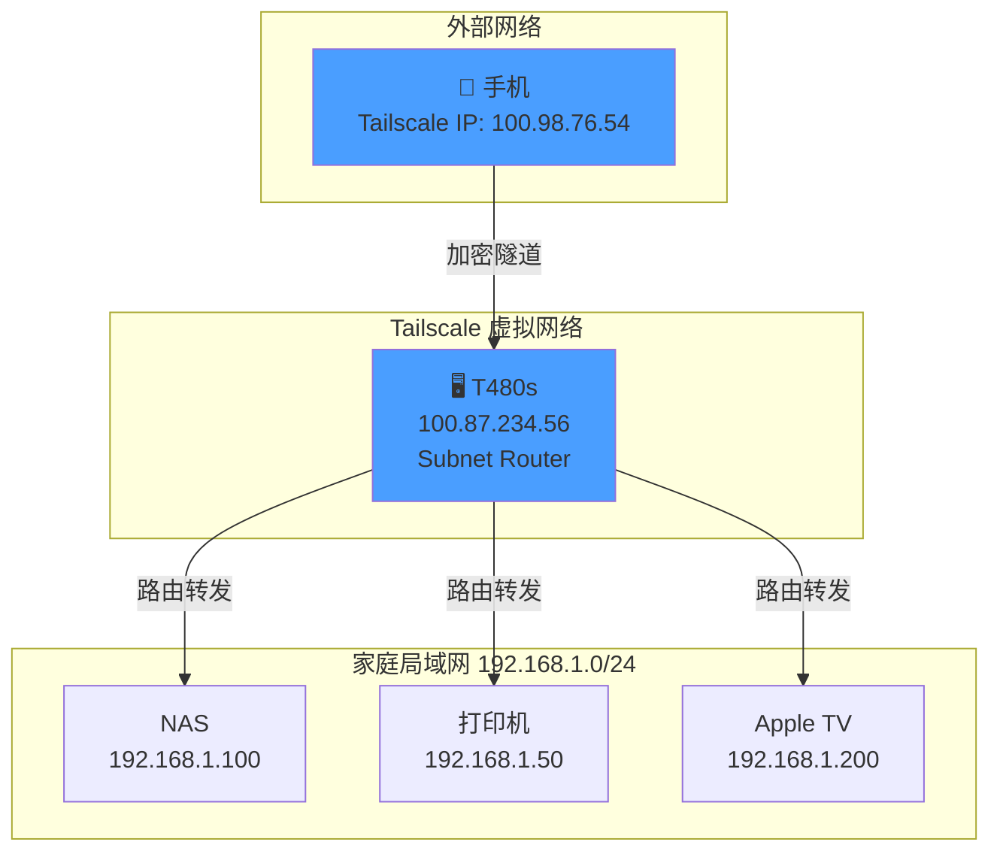
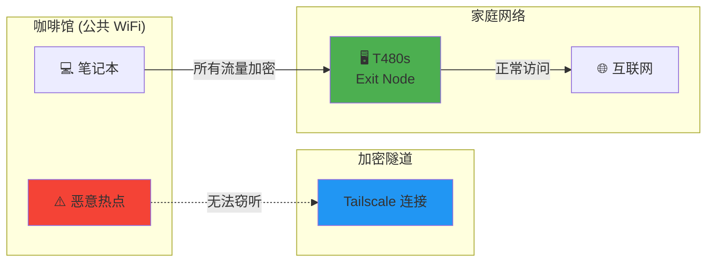
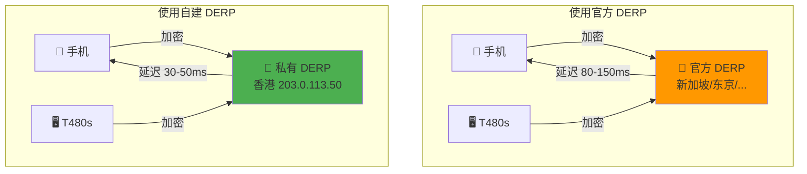

> 基于 T480s (ubuntu xits ) 实际部署经验，包含完整配置和原理图解

---

## 📋 本文使用的资源示例

为了阅读流畅，本文统一使用以下示例资源，实际使用时替换成你自己的：

| 资源类型 | 示例值 | 说明 |
|----------|--------|------|
| **T480s（家庭服务器）** | | |
| Tailscale IP | `100.87.234.56` | 登录后自动分配 |
| 局域网 IP | `192.168.1.10` | 路由器分配的内网 IP |
| 局域网网段 | `192.168.1.0/24` | 家庭网络范围 |
| **VPS（香港，用于 DERP）** | | |
| 公网 IP | `203.0.113.50` | 你的 VPS 公网 IP |
| 域名 | `derp.example.com` | 解析到 VPS IP 的域名 |
| 地区 ID | `999` | 自定义 DERP 区域编号 |

---

## 一、什么是 Tailscale？

### 核心概念

Tailscale 是一个基于 **WireGuard** 的组网工具，让分散在世界各地的设备看起来像在同一个局域网里。

### 解决的问题

| 场景 | 传统方案 | Tailscale 方案 |
|------|----------|----------------|
| 远程访问家里 NAS | 端口映射（危险） | 直接访问 Tailscale IP |
| 多设备互访 | 复杂 VPN 配置 | 自动发现，零配置 |
| 公共 WiFi 安全 | 买商业 VPN | 用自家 VPS 当出口节点 |
| 绕过网络限制 | 手动代理配置 | Exit Node 一键切换 |

### 架构原理（使用官方 DERP）



---

## 二、快速开始

### 2.1 安装 Tailscale

#### Linux (T480s)

```bash
# 一键安装脚本
curl -fsSL https://tailscale.com/install.sh | sh

# 启动服务
sudo systemctl enable --now tailscaled

# 登录激活
sudo tailscale up
```

输出会包含一个链接，类似：
```
https://login.tailscale.com/a/abc123xyz
```

#### macOS

```bash
brew install tailscale
sudo tailscale up
```

#### Windows

下载安装包：https://tailscale.com/download

#### iOS/Android

应用商店搜索 "Tailscale" 安装即可。

### 2.2 验证安装

```bash
# 查看状态
tailscale status

# 查看分配的 IP
tailscale ip

# 测试连接到其他设备
tailscale ping 100.87.234.56
```

### 2.3 控制台管理

登录 https://login.tailscale.com/admin 可以：
- 查看所有设备
- 管理访问权限
- 配置 DNS
- 设置子网路由

---

## 三、基础使用场景

### 3.1 远程访问 T480s 服务

假设 T480s 上运行了以下服务：

| 服务 | 本地端口 | Tailscale 访问地址 |
|------|----------|-------------------|
| OpenClaw | 18789 | `http://100.87.234.56:18789` |
| SSH | 22 | `ssh user@100.87.234.56` |
| 文件服务 | 8080 | `http://100.87.234.56:8080` |

**优势**：无需在路由器配置端口转发，防火墙保持关闭。

### 3.2 访问整个家庭网络（Subnet Router）

#### 配置步骤

1. **在 T480s 上宣告路由**：
```bash
sudo tailscale up --advertise-routes=192.168.1.0/24
```

2. **在控制台批准路由**：
   - 登录 https://login.tailscale.com
   - 找到 T480s 设备
   - 点击 "Edit routes"
   - 批准 `192.168.1.0/24`

3. **验证**：
```bash
# 应该能 ping 通家里其他设备
ping 192.168.1.100  # NAS
ping 192.168.1.50   # 打印机
```

#### 架构图



### 3.3 Exit Node（出口节点）

把 T480s 设为出口节点，所有流量从家里出去：

#### 配置步骤

1. **在 T480s 上宣告 Exit Node**：
```bash
sudo tailscale up --advertise-exit-node
```

2. **在控制台批准**：
   - 找到 T480s 设备
   - 点击 "Edit exit node"
   - 启用 "Use as exit node"

3. **在客户端启用**：
```bash
# macOS/Linux
tailscale set --exit-node=100.87.234.56

# 或在图形界面选择
```

#### 使用场景




---

## 四、访问控制（ACLs）

### 4.1 默认行为

默认情况下，同一个 tailnet 里的所有设备可以**互相访问所有端口**。

### 4.2 配置 ACL

在控制台 → Settings → Access Control 编辑：

```json
{
  "acls": [
    {
      "action": "accept",
      "src": ["user:logan@example.com"],
      "dst": ["*:*"]
    },
    {
      "action": "accept",
      "src": ["tag:server"],
      "dst": ["tag:server:*"]
    },
    {
      "action": "accept",
      "src": ["tag:workstation"],
      "dst": ["tag:server:22,80,443"]
    }
  ],
  
  "tagOwners": {
    "server": ["group:admins"],
    "workstation": ["group:members"]
  },
  
  "groups": {
    "group:admins": ["user:logan@example.com"],
    "group:members": ["user:alice@example.com", "user:bob@example.com"]
  }
}
```

### 4.3 给设备打标签

```bash
# T480s 标记为 server
sudo tailscale up --advertise-tags=tag:server

# 笔记本标记为 workstation
tailscale up --advertise-tags=tag:workstation
```

---

## 五、自建 DERP 服务器

### 5.1 为什么需要自建 DERP？

#### P2P 连接失败的情况

| 情况 | 原因 | 解决方案 |
|------|------|----------|
| 对称 NAT | 运营商级 NAT | 必须走中继 |
| 防火墙严格 | 企业/学校网络 | 必须走中继 |
| IPv6 不兼容 | 一方只有 IPv4 | 必须走中继 |
| 国内访问慢 | 官方 DERP 在海外 | 自建国内/香港节点 |

#### 官方 DERP vs 自建 DERP



### 5.2 部署前准备

#### 资源清单

| 项目 | 要求 | 本文示例 |
|------|------|----------|
| VPS | 1 核 512M 即可 | 香港，2 核 2G |
| 公网 IP | 需要 | `203.0.113.50` |
| 域名 | 可选，推荐 | `derp.example.com` |
| 开放端口 | 80, 443, 3478/UDP | - |

#### DNS 配置

在域名服务商处添加记录：

```
A     derp.example.com    203.0.113.50
AAAA  derp.example.com    2001:db8::1  (如有 IPv6)
```

### 5.3 安装步骤

#### Step 1: 安装 Tailscale

```bash
# 下载最新稳定版
wget https://pkgs.tailscale.com/stable/tailscale_1.78.1_amd64.tgz
tar -xzf tailscale_*.tgz

# 安装到系统目录
sudo cp tailscale_1.78.1_amd64/tailscaled /usr/local/bin/
sudo cp tailscale_1.78.1_amd64/tailscale /usr/local/bin/

# 验证安装
tailscaled --version
```

#### Step 2: 创建配置文件

```bash
# 创建配置目录
sudo mkdir -p /var/lib/tailscale

# 创建 DERP 配置文件
sudo tee /var/lib/tailscale/derp.yaml << 'EOF'
region_id: 999
region_code: hk
region_name: "Hong Kong Private DERP"
nodes:
  - name: "999"
    region_id: 999
    host_name: "derp.example.com"
    ipv4: "203.0.113.50"
    ipv6: ""
    stun_port: 3478
    stun_test_ip: true
    can_port_80: true
    force_http: false
    cert_name: "derp.example.com"
    stun_only: false
    no_stun: false
    http_port: 80
    https_port: 443
EOF
```

#### Step 3: 创建 systemd 服务

```bash
sudo tee /etc/systemd/system/tailscale-derp.service << 'EOF'
[Unit]
Description=Tailscale DERP Server
After=network.target

[Service]
Type=notify
ExecStart=/usr/local/bin/tailscaled --tun=userspace-networking --derp.server.enable=true --derp.server.region-config-file=/var/lib/tailscale/derp.yaml
Restart=always
LimitNOFILE=1000000

[Install]
WantedBy=multi-user.target
EOF
```

#### Step 4: 启动服务

```bash
# 重载 systemd
sudo systemctl daemon-reload

# 启动 DERP 服务
sudo systemctl enable --now tailscale-derp

# 查看状态
sudo systemctl status tailscale-derp

# 查看日志
sudo journalctl -u tailscale-derp -f
```

#### Step 5: 配置防火墙

```bash
# UFW (Ubuntu/Debian)
sudo ufw allow 80/tcp
sudo ufw allow 443/tcp
sudo ufw allow 3478/udp
sudo ufw allow 41641/udp

# 或者 firewalld (CentOS/RHEL)
sudo firewall-cmd --permanent --add-port=80/tcp
sudo firewall-cmd --permanent --add-port=443/tcp
sudo firewall-cmd --permanent --add-port=3478/udp
sudo firewall-cmd --permanent --add-port=41641/udp
sudo firewall-cmd --reload
```

### 5.4 注册到 Tailscale

DERP 服务器本身也需要加入 tailnet：

```bash
# 登录激活
sudo tailscale up --hostname=derp-hk

# 验证状态
tailscale status
```

### 5.5 配置客户端使用私有 DERP

#### 方法一：控制台配置（推荐）

1. 登录 https://login.tailscale.com
2. Settings → Custom DERP Servers
3. 添加你的 DERP 配置：

```json
{
  "Regions": {
    "999": {
      "RegionID": 999,
      "RegionCode": "hk",
      "RegionName": "Hong Kong Private",
      "Nodes": [
        {
          "Name": "999",
          "RegionID": 999,
          "HostName": "derp.example.com",
          "IPv4": "203.0.113.50",
          "STUNPort": 3478,
          "HTTPSPort": 443
        }
      ]
    }
  }
}
```

#### 方法二：客户端配置

```bash
# 指定 DERP 服务器
sudo tailscale up --derp-server=https://derp.example.com

# 或者使用 IP
sudo tailscale up --derp-server=https://203.0.113.50
```

### 5.6 验证部署

```bash
# 查看网络诊断信息
tailscale netcheck

# 查看当前使用的 DERP
tailscale debug derp

# 测试延迟
tailscale ping 100.87.234.56
```

#### 预期输出

```
Report:
  * UDP: true
  * IPv4: yes, 203.0.113.50:41641
  * IPv6: no
  * MappingVariesByDestIP: false
  * HairPinning: false
  * Nearest DERP: Hong Kong Private
  * DERP latency:
    - 999 (hk): 35ms  ← 你的私有 DERP
    - 6 (singapore): 85ms
    - 5 (tokyo): 120ms
```

---

## 六、性能对比

### 6.1 延迟测试

从 T480s 测试到手机（外地）的延迟：

| 连接方式 | 延迟 | 说明 |
|----------|------|------|
| P2P 直连 | 25ms | 最佳情况 |
| 私有 DERP（香港） | 35ms | P2P 失败时 |
| 官方 DERP（新加坡） | 85ms | 默认中继 |
| 官方 DERP（东京） | 120ms | 备用中继 |

### 6.2 速度测试

```bash
# 在 T480s 上启动测试服务器
iperf3 -s

# 在客户端测试
iperf3 -c 100.87.234.56
```

| 场景 | 下载速度 | 上传速度 |
|------|----------|----------|
| P2P 直连 | 50 MB/s | 30 MB/s |
| 私有 DERP | 40 MB/s | 25 MB/s |
| 官方 DERP | 8 MB/s | 5 MB/s |

### 6.3 成本分析

| 方案 | 月成本 | 维护成本 | 推荐度 |
|------|--------|----------|--------|
| 纯官方 DERP | $0 | 无 | ⭐⭐⭐ |
| 自建 DERP (VPS) | ~$5 | 低 | ⭐⭐⭐⭐⭐ |
| 自建 + 官方混合 | ~$5 | 低 | ⭐⭐⭐⭐ |

---

## 七、故障排查

### 7.1 常见问题

#### 问题 1：设备离线

```bash
# 检查服务状态
sudo systemctl status tailscaled

# 重启服务
sudo systemctl restart tailscaled

# 重新登录
sudo tailscale logout
sudo tailscale up
```

#### 问题 2：无法连接

```bash
# 检查防火墙
sudo ufw status

# 检查端口监听
sudo netstat -tlnp | grep tailscaled

# 查看日志
sudo journalctl -u tailscaled -f
```

#### 问题 3：DERP 不工作

```bash
# 检查 DERP 服务
sudo systemctl status tailscale-derp

# 检查证书
sudo tailscale debug cert derp.example.com

# 测试 HTTPS 端点
curl -v https://derp.example.com/derp
```

### 7.2 诊断命令汇总

```bash
# 完整状态报告
tailscale status --json

# 网络诊断
tailscale netcheck

# P2P 连接测试
tailscale ping <target-ip>

# 查看路由
tailscale debug routes

# 导出日志
tailscale debug logs
```

---

## 八、最佳实践

### 8.1 安全建议

1. **启用双因素认证**：在 Tailscale 控制台开启 2FA
2. **使用 ACL 限制访问**：不要默认允许所有
3. **定期轮换密钥**：`tailscale logout && tailscale up`
4. **监控异常登录**：开启邮件通知

### 8.2 性能优化

1. **优先 P2P**：确保 UDP 41641 端口开放
2. **就近 DERP**：选择地理位置最近的中继
3. **启用 MagicDNS**：减少 DNS 查询延迟
4. **使用压缩**：对文本流量启用压缩

### 8.3 备份配置

```bash
# 备份 ACL 配置
curl -H "Authorization: Bearer $TS_API_KEY" \
  https://api.tailscale.com/api/v2/tailnet/example.com/acl > acl-backup.json

# 备份设备列表
tailscale status --json > devices-backup.json
```

---

## 附录 A：完整配置文件

### A.1 T480s 启动脚本

```bash
#!/bin/bash
# /usr/local/bin/tailscale-t480s.sh

TAILSCALE_IP="100.87.234.56"
LAN_ROUTE="192.168.1.0/24"

# 启动并配置
sudo tailscale up \
  --advertise-routes=$LAN_ROUTE \
  --advertise-exit-node \
  --advertise-tags=tag:server \
  --hostname=t480s-home

# 验证
tailscale status
tailscale ip
```

### A.2 DERP 监控脚本

```bash
#!/bin/bash
# /usr/local/bin/derp-monitor.sh

DERP_URL="https://derp.example.com/derp"
LOG_FILE="/var/log/derp-health.log"

check_derp() {
  if curl -sf "$DERP_URL" > /dev/null; then
    echo "$(date): DERP OK" >> $LOG_FILE
  else
    echo "$(date): DERP DOWN" >> $LOG_FILE
    # 可以添加告警通知
  fi
}

check_derp
```

### A.3 自动化部署脚本

```bash
#!/bin/bash
# deploy-derp.sh

set -e

DERP_DOMAIN="derp.example.com"
DERP_IP="203.0.113.50"
REGION_ID="999"

echo "=== Tailscale DERP 自动部署 ==="

# 1. 安装 Tailscale
curl -fsSL https://tailscale.com/install.sh | sh

# 2. 创建配置
sudo mkdir -p /var/lib/tailscale
sudo tee /var/lib/tailscale/derp.yaml << EOF
region_id: $REGION_ID
region_code: hk
region_name: "Hong Kong Private DERP"
nodes:
  - name: "$REGION_ID"
    region_id: $REGION_ID
    host_name: "$DERP_DOMAIN"
    ipv4: "$DERP_IP"
    stun_port: 3478
    stun_test_ip: true
    can_port_80: true
    force_http: false
    cert_name: "$DERP_DOMAIN"
    stun_only: false
    no_stun: false
    http_port: 80
    https_port: 443
EOF

# 3. 配置 systemd
sudo systemctl daemon-reload
sudo systemctl enable --now tailscale-derp

# 4. 激活
sudo tailscale up --hostname=derp-hk

echo "=== 部署完成 ==="
echo "请记得在控制台配置 Custom DERP"
```

---

## 附录 B：参考资源

| 类型 | 链接 |
|------|------|
| 官方文档 | https://tailscale.com/kb/ |
| DERP 部署指南 | https://tailscale.com/kb/1118/custom-derp-servers/ |
| ACL 配置文档 | https://tailscale.com/kb/1018/acls/ |
| GitHub 配置示例 | https://github.com/tailscale/tailscale |
| 社区论坛 | https://forum.tailscale.com/ |

---

**最后更新**: 2026-03-04  
**适用版本**: Tailscale 1.78+  
**测试环境**: Ubuntu 22.04, T480s, 香港 VPS

