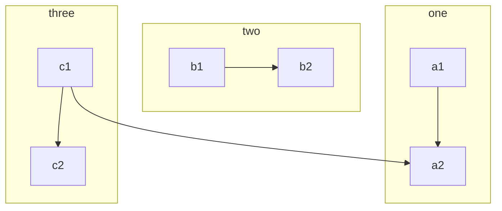
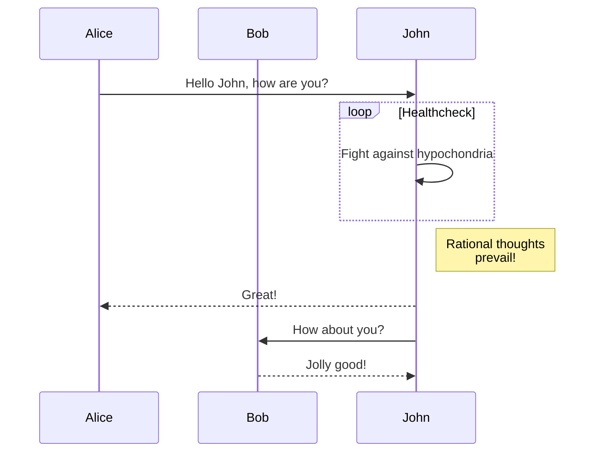
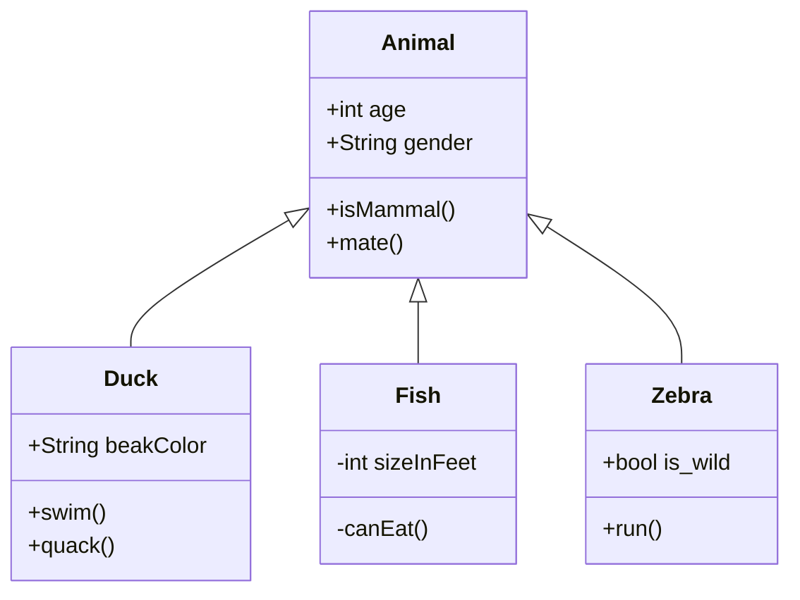
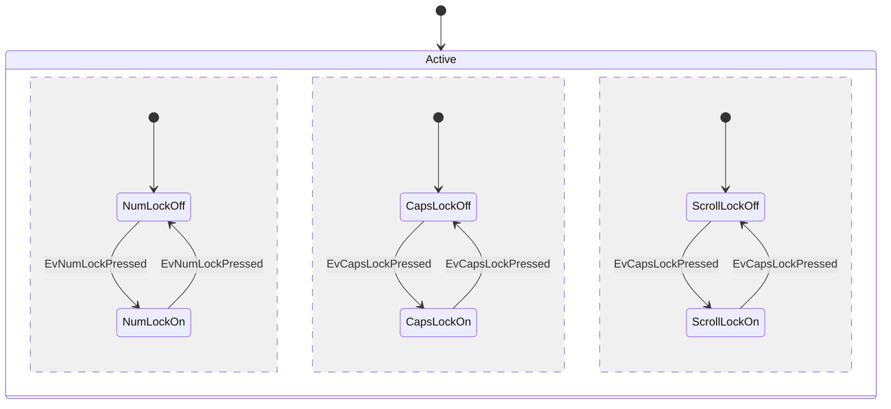
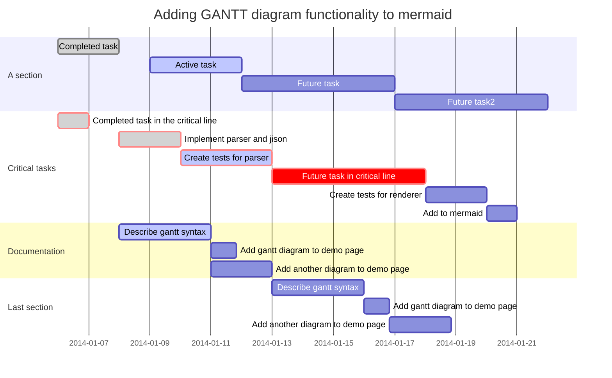
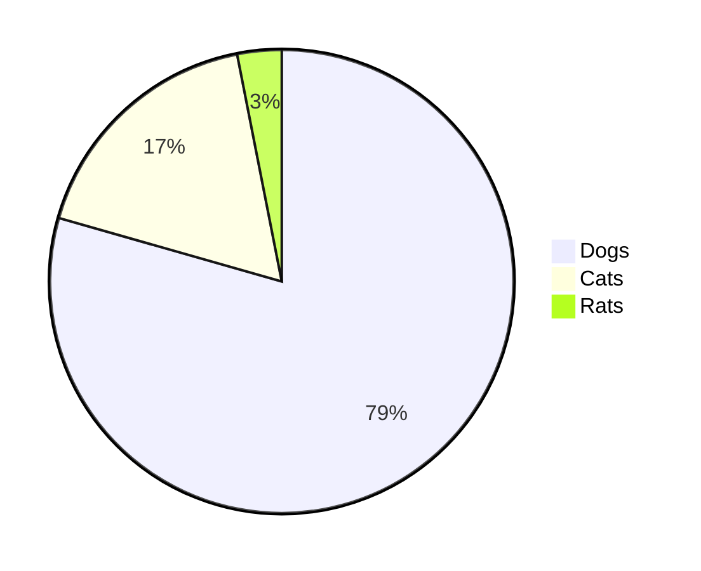

## 一、说明
### 开启
1. 安装hexo插件
```bash
npm install hexo-filter-mermaid-diagrams
```
2. 修改`themes/3-hexo/_config.yml` 的 `mermaid.on`，开启主题支持
```yml
# Mermaid 支持
mermaid:
  on: true
  cdn: //cdn.jsdelivr.net/npm/mermaid@8.4.2/dist/mermaid.min.js
  #cdn: //cdnjs.cloudflare.com/ajax/libs/mermaid/8.3.1/mermaid.min.js
  options: # 更多配置信息可以参考 https://mermaidjs.github.io/#/mermaidAPI
    theme: 'default'
    startOnLoad: true
    flowchart:
      useMaxWidth: false
      htmlLabels: true
```
3. 在markdown中，像写代码块一样写图表


## 二、示例
以下示例源码可以在这边查看 [本文源码](https://github.com/yelog/blog/blob/master/source/_posts/tools/3-hexo%E6%94%AF%E6%8C%81mermaid%E5%9B%BE%E8%A1%A8.md)
更多示例可以查看官网：[https://mermaidjs.github.io](https://mermaidjs.github.io)

### 1. flowchart



### 2.Sequence diagrams



### 3.Class diagrams


### 4.State diagrams


### 5.Gantt diagrams


### 6.Pie chart diagrams

